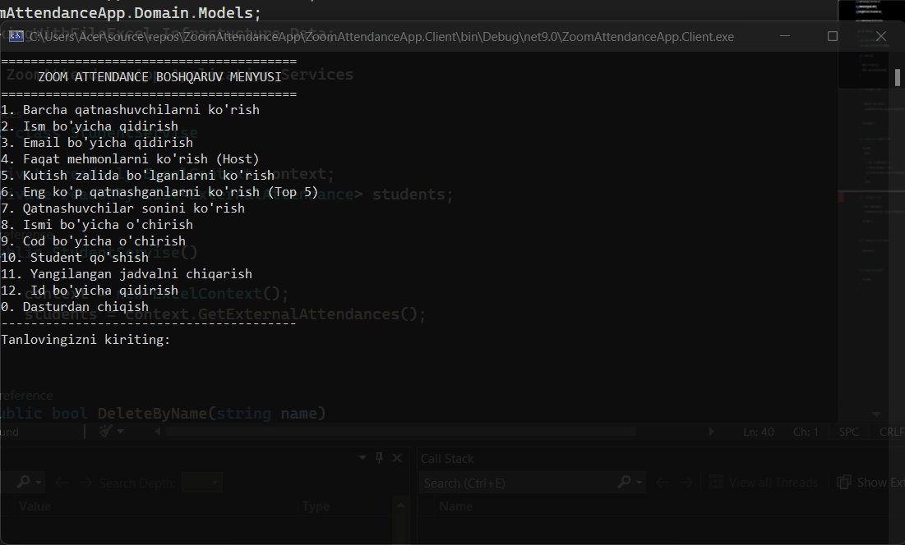

Zoom Attendance App – Project Overview
## 🎥 Application Demo

Zoom Attendance App is a C# Console Application designed to manage participants in Zoom classes or meetings.
The application allows users to view, search, add, delete, and analyze attendance data.

The project is structured close to Clean Architecture principles and is divided into Domain, Application, and Infrastructure layers.

Technologies

C# (.NET Console Application)

EPPlus (for working with Excel files)

LINQ

OOP principles (Encapsulation, Abstraction)

Project Structure
ZoomAttendanceApp
│
├── Domain
│   └── Models
│       └── ExternalAttendance.cs
│
├── Application
│   └── Services
│       ├── StudentServise.cs
│       ├── AttendanceService.cs
│       └── ExternalAttendanceService.cs
│
├── Infrastructure
│   └── Data
│       └── ExcelContext.cs
│
└── Program.cs

Note

The FullNameWithCode field contains both the full name and the student code.
Example: Eldor Roziyev 1244 — the last number is used as the student code.

How to Run the Application

Clone the repository:

git clone https://github.com/username/ZoomAttendanceApp.git

Open the project in Visual Studio

Run the Program.cs file

Use the console menu to interact with the application

Author

Eldor
C# Backend Developer (Junior)
